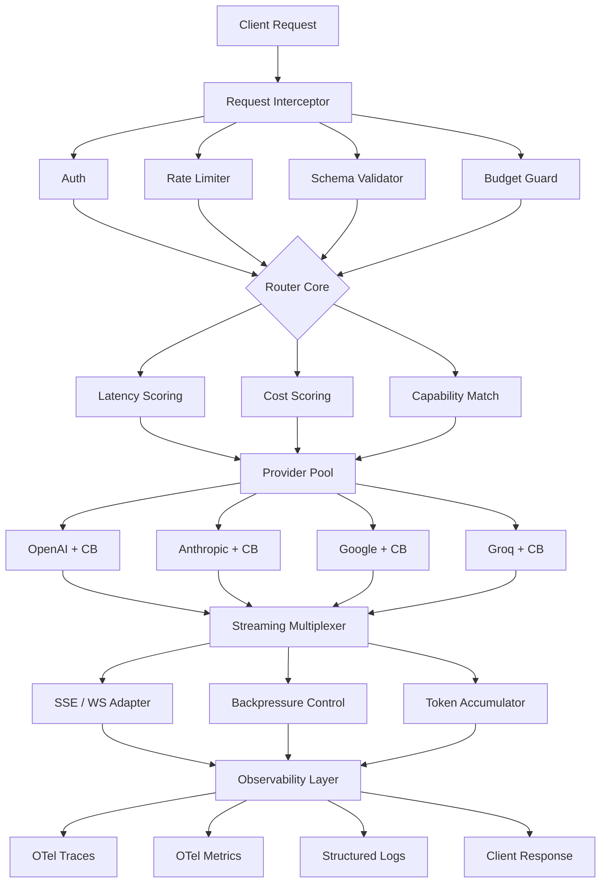
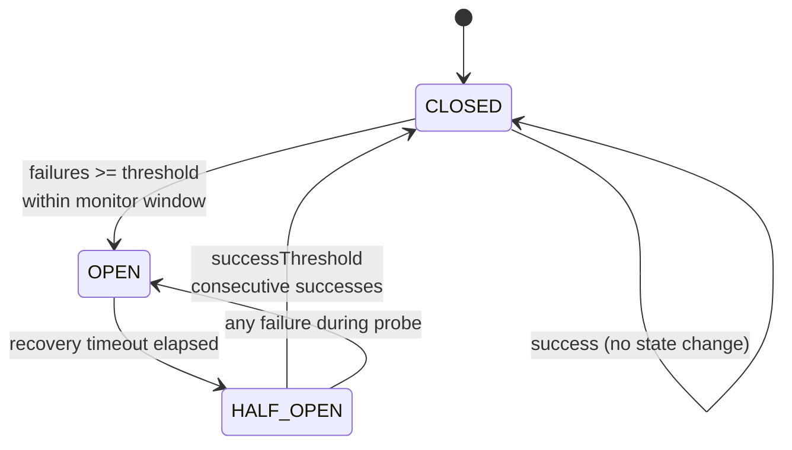

# inference-gateway

> Multi-provider LLM inference routing with circuit breakers, cost-aware load balancing, streaming multiplexer, automatic fallback, and native OpenTelemetry observability.

[](https://www.typescriptlang.org/)
[](https://nodejs.org/)
[](LICENSE)
[](#project-status)

## Project Status

**Work in progress.** The architecture and core modules (routing, circuit breaker, cost engine) are implemented. Provider adapters and the telemetry exporter are in development. No published benchmarks yet: the Performance Targets section below states design goals, not measured results.

## Problem

Running LLMs in production against a single provider is fragile:

- **Outages cascade.** When OpenAI degrades, your product degrades with it.
- **Costs are opaque.** Token spend is invisible until the invoice arrives.
- **Model choice is static.** A trivial classification call hits the same expensive model as a complex reasoning task.
- **Rate limits are hard walls.** No graceful degradation, just 429s.

This gateway sits between your application and every LLM provider, making provider choice a runtime decision based on health, cost, and latency.

## Architecture



### Circuit Breaker State Machine



## Features

### Routing Strategies

| Strategy | Selection Criterion | Best For |
|----------|--------------------|----------|
| `round-robin` | Weighted rotation across healthy providers | Even load distribution |
| `least-latency` | Lowest rolling P95 latency | Interactive UX |
| `cost-optimized` | Lowest blended token price | Batch / background jobs |
| `capability-based` | Required features (vision, tools, context length) | Mixed workloads |

### Circuit Breaker (per provider)

Three-state machine with configurable thresholds. Failures are counted within a rolling monitor window, so a burst of errors an hour ago doesn't keep the circuit open. During `HALF_OPEN`, a limited number of probe requests test recovery, and any failure immediately reopens the circuit.

### Streaming Multiplexer

Providers expose different streaming protocols (OpenAI SSE with `data:` frames, Anthropic event-typed SSE, Google's chunked JSON). The multiplexer normalizes all of them into a single `AsyncGenerator<StreamChunk>` interface, with backpressure so a slow consumer doesn't blow up memory.

### Cost Engine

Every request is priced at completion using a per-model pricing registry (input and output tokens billed separately). Budgets can be enforced daily and monthly with soft-warning and hard-block thresholds. Cost is attributable per tenant, per model, and per endpoint.

### Observability

OpenTelemetry-native. Traces span the full request lifecycle including routing decisions and circuit breaker transitions as discrete spans, so you can see exactly *why* a request went to a given provider.

## Installation

```bash
npm install @q1-digital/inference-gateway
```

## Quick Start

```typescript
import { InferenceGateway } from '@q1-digital/inference-gateway';

const gateway = new InferenceGateway({
  providers: [
    {
      name: 'openai',
      apiKey: process.env.OPENAI_API_KEY!,
      models: ['gpt-4o', 'gpt-4o-mini'],
      weight: 0.6,
      circuitBreaker: {
        failureThreshold: 5,
        recoveryTimeout: 30_000,
        successThreshold: 3,
        monitorWindow: 60_000,
      },
    },
    {
      name: 'anthropic',
      apiKey: process.env.ANTHROPIC_API_KEY!,
      models: ['claude-sonnet-4-20250514', 'claude-haiku-4-20250514'],
      weight: 0.3,
    },
    {
      name: 'groq',
      apiKey: process.env.GROQ_API_KEY!,
      models: ['llama-3.3-70b-versatile'],
      weight: 0.1,
      priority: 'low-latency',
    },
  ],
  routing: {
    strategy: 'cost-optimized',
    fallbackChain: ['openai', 'anthropic', 'groq'],
  },
  budget: {
    daily: 50.00,
    monthly: 1200.00,
    alertThreshold: 0.8,
  },
  telemetry: {
    serviceName: 'inference-gateway',
    exporterEndpoint: process.env.OTEL_EXPORTER_ENDPOINT,
  },
});

// Non-streaming
const response = await gateway.complete({
  messages: [{ role: 'user', content: 'Explain quantum computing' }],
  model: 'auto',
  maxTokens: 1024,
});

console.log(response.provider);   // Which provider handled it
console.log(response.cost.total); // USD cost of this call
console.log(response.latency);    // Milliseconds

// Streaming
for await (const chunk of gateway.stream({
  messages: [{ role: 'user', content: 'Write a poem' }],
  model: 'auto',
})) {
  process.stdout.write(chunk.delta);
}
```

### Observing Provider Health

```typescript
gateway.on('circuit:open', ({ provider, failures }) => {
  console.warn(`${provider} circuit opened after ${failures} failures`);
});

gateway.on('budget:warning', ({ usage, limit, period }) => {
  console.warn(`${period} budget at ${((usage / limit) * 100).toFixed(0)}%`);
});

const health = gateway.getProviderHealth();
// { openai: { state: 'CLOSED', failures: 0, latencyP95: 842 }, ... }
```

## Configuration

```typescript
interface GatewayConfig {
  providers: ProviderConfig[];
  routing: RoutingConfig;
  budget?: BudgetConfig;
  telemetry?: TelemetryConfig;
  retry?: RetryConfig;
}

interface ProviderConfig {
  name: string;
  apiKey: string;
  baseUrl?: string;
  models: string[];
  weight?: number;
  priority?: 'low-latency' | 'low-cost' | 'high-quality';
  circuitBreaker?: CircuitBreakerConfig;
  rateLimit?: { rpm: number; tpm: number };
  timeout?: number;
}

interface CircuitBreakerConfig {
  failureThreshold: number;  // Failures before opening
  recoveryTimeout: number;   // Ms before attempting HALF_OPEN
  successThreshold: number;  // Consecutive successes to close
  monitorWindow: number;     // Rolling window for failure counting
}
```

## Project Structure

```
src/
├── core/
│   ├── gateway.ts              # Main orchestrator + event emitter
│   ├── router.ts               # Routing strategy engine
│   └── config.ts               # Zod configuration schemas
├── providers/
│   ├── base.provider.ts        # Abstract provider interface
│   ├── openai.provider.ts
│   ├── anthropic.provider.ts
│   ├── google.provider.ts
│   └── groq.provider.ts
├── resilience/
│   ├── circuit-breaker.ts      # Three-state machine
│   ├── retry.ts                # Exponential backoff with jitter
│   ├── timeout.ts              # Deadline propagation
│   └── bulkhead.ts             # Concurrency isolation
├── streaming/
│   ├── multiplexer.ts          # Protocol normalization
│   ├── backpressure.ts         # Flow control
│   └── accumulator.ts          # Token counting + buffering
├── cost/
│   ├── calculator.ts           # Per-request pricing
│   ├── budget.ts               # Enforcement + alerts
│   └── pricing.ts              # Model pricing registry
├── telemetry/
│   ├── tracer.ts               # OTel trace setup
│   ├── metrics.ts              # Prometheus-compatible metrics
│   └── logger.ts               # Structured logging (Pino)
└── index.ts
```

## Performance Targets

These are **design goals** for the implementation, not measured benchmarks. A reproducible benchmark suite is on the roadmap.

| Metric | Target |
|--------|--------|
| Routing decision overhead | Sub-millisecond (pure in-memory scoring) |
| Streaming first-byte overhead | Negligible vs. direct provider call |
| Circuit breaker evaluation | O(1) amortized, no allocations on hot path |
| Memory per active stream | Bounded by configured buffer size |

## Design Decisions

**Why rolling-window failure counting?** A fixed counter never resets, so a provider that failed 5 times over a week would stay permanently open. The rolling window means only recent failures count toward the threshold.

**Why fail HALF_OPEN on a single error?** Half-open exists to probe recovery. If the probe fails, the provider is still unhealthy, and letting more traffic through would just produce more user-facing errors.

**Why rank-based cost scoring instead of absolute price?** Absolute prices change per provider announcement. Ranking is stable and lets you swap the pricing registry without retuning routing weights.

## Roadmap

- [ ] Complete provider adapters (OpenAI, Anthropic, Google, Groq)
- [ ] Reproducible benchmark suite with published methodology
- [ ] Semantic response caching
- [ ] Adaptive routing (learn provider performance over time)
- [ ] Multi-region provider pools
- [ ] Plugin API for custom routing strategies

## License

MIT
